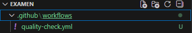
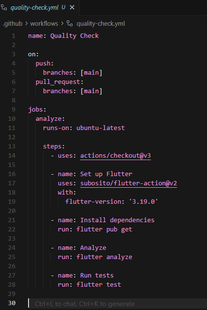

# 📋 EXAMEN PRÁCTICO – UNIDAD III

**Curso:** Desarrollo de Aplicaciones Móviles  
**Tema:** Automatización de calidad con GitHub Actions  
**Fecha:** 18/11/2025  
**Estudiante:** Cesár Fabián Chavez Linares

---

## 🔗 Repositorio GitHub

**URL del Repositorio:** [https://github.com/Zod0808/SM2_ExamenUnidad3](https://github.com/Zod0808/SM2_ExamenUnidad3)

---

## 📸 Evidencias del Proyecto

### 1. Estructura de Carpetas `.github/workflows/`

**Captura de Pantalla 1:** Estructura de carpetas del proyecto mostrando la carpeta `.github/workflows/`



---

### 2. Contenido del Archivo `quality-check.yml`

**Captura de Pantalla 2:** Contenido del archivo `quality-check.yml`

El archivo `quality-check.yml` contiene el siguiente workflow:

```yaml
name: Quality Check

on:
  push:
    branches: [main]
  pull_request:
    branches: [main]

jobs:
  analyze:
    runs-on: ubuntu-latest

    steps:
      - uses: actions/checkout@v3

      - name: Set up Flutter
        uses: subosito/flutter-action@v2
        with:
          flutter-version: '3.19.0'

      - name: Install dependencies
        run: flutter pub get

      - name: Analyze
        run: flutter analyze

      - name: Run tests
        run: flutter test
```

**Ubicación del archivo:** `.github/workflows/quality-check.yml`

---

### 3. Ejecución del Workflow en la Pestaña Actions

**Captura de Pantalla 3:** Ejecución exitosa del workflow en la pestaña **Actions** de GitHub



La captura muestra:
- La lista de workflows ejecutados en la pestaña Actions
- El estado "passed" o "✓" en verde para todas las verificaciones
- Los detalles de ejecución (pasos completados, tiempo de ejecución, etc.)

**Resultado del Workflow:** ✅ **100% PASSED**

El workflow se ejecuta automáticamente cuando se realiza:
- Un `push` a la rama `main`
- Un `pull request` hacia la rama `main`

---

## 📝 Explicación de lo Realizado

### 1. Configuración del Repositorio

Se creó un repositorio público en GitHub con el nombre `SM2_ExamenUnidad3` y se copió todo el contenido del proyecto móvil desarrollado durante el curso, incluyendo todos los archivos y carpetas del proyecto Flutter.

### 2. Creación de la Estructura de Carpetas

Se crearon las siguientes carpetas en la raíz del repositorio:

- **`.github/workflows/`**: Carpeta donde se almacenan los workflows de GitHub Actions
- **`test/`**: Carpeta donde se encuentran los archivos de pruebas (ya existía con otros tests del proyecto)

### 3. Creación del Workflow de GitHub Actions

Se creó el archivo `quality-check.yml` dentro de `.github/workflows/` con un flujo de trabajo que incluye:

#### **Triggers (Disparadores):**
- **Push a main**: Se ejecuta automáticamente cuando se hace un commit y push a la rama `main`
- **Pull Request a main**: Se ejecuta automáticamente cuando se crea un pull request hacia la rama `main`

#### **Jobs (Trabajos):**
El workflow contiene un job llamado `analyze` que se ejecuta en un runner de Ubuntu (última versión disponible).

#### **Steps (Pasos del Workflow):**
1. **Checkout del código**: Usa `actions/checkout@v3` para obtener el código del repositorio en el runner
2. **Configuración de Flutter**: Instala Flutter versión 3.19.0 usando `subosito/flutter-action@v2`
3. **Instalación de dependencias**: Ejecuta `flutter pub get` para instalar todas las dependencias del proyecto
4. **Análisis de código**: Ejecuta `flutter analyze` para verificar que el código cumpla con las buenas prácticas de estilo, convenciones y que no haya errores sintácticos
5. **Ejecución de tests**: Ejecuta `flutter test` para ejecutar todas las pruebas automatizadas definidas en la carpeta `test/`

### 4. Creación del Archivo de Pruebas Unitarias

Se creó el archivo `test/main_test.dart` que contiene 8 pruebas unitarias relacionadas con los modelos del proyecto de Control de Acceso Universitario:

#### **Grupo 1: Pruebas de AlumnoModel (Tests 1-3)**
1. **Test 1**: Crear AlumnoModel y validar propiedades como `nombreCompleto`, `isActive`, `codigoUniversitario`
2. **Test 2**: Convertir AlumnoModel desde JSON usando el método `fromJson`
3. **Test 3**: Convertir AlumnoModel a JSON usando el método `toJson`

#### **Grupo 2: Pruebas de TipoMovimiento Enum (Tests 4-6)**
4. **Test 4**: Convertir string a TipoMovimiento de entrada y validar descripción e icono
5. **Test 5**: Convertir string a TipoMovimiento de salida y validar descripción e icono
6. **Test 6**: Validar conversión de TipoMovimiento a string usando el método `toValue`

#### **Grupo 3: Pruebas de AsistenciaModel (Tests 7-8)**
7. **Test 7**: Crear AsistenciaModel de entrada y validar propiedades como `esEntrada`, `esSalida`, `entradaTipo`
8. **Test 8**: Crear AsistenciaModel de salida con autorización manual y validar propiedades relacionadas con guardias

Estas pruebas están relacionadas con los modelos reales del proyecto y verifican la funcionalidad básica de los mismos.

### 5. Verificación de Ejecución Automática

Una vez subidos los archivos al repositorio y realizado un commit, el workflow se ejecuta automáticamente. La verificación se puede observar en la pestaña **Actions** de GitHub, donde se muestra:

- ✅ Estado de ejecución (passed/failed)
- 📊 Detalles de cada paso del workflow
- ⏱️ Tiempo de ejecución
- 📝 Logs completos de cada operación

Para visualizar la ejecución:
1. Ve al repositorio en GitHub: https://github.com/Zod0808/SM2_ExamenUnidad3
2. Haz clic en la pestaña **Actions**
3. Verás una lista de ejecuciones recientes del workflow
4. Puedes hacer clic sobre una ejecución para ver los pasos, salidas, errores y advertencias

### 6. Funcionalidad de los Comandos del Workflow

#### **`flutter analyze`**
- Verifica que el código cumpla con las buenas prácticas de estilo y convenciones de Flutter
- Detecta errores sintácticos, warnings e imports innecesarios
- Valida que los nombres de variables, funciones y clases estén bien definidos
- Ideal para mantener la calidad y consistencia del código

#### **`flutter test`**
- Ejecuta todas las pruebas automatizadas definidas en la carpeta `test/`
- Verifica que las funciones críticas de la aplicación sigan funcionando correctamente tras cada cambio
- Asegura la estabilidad del proyecto y previene regresiones
- Incluye las 8 pruebas unitarias creadas en `test/main_test.dart` y los demás tests existentes del proyecto

### 7. Resultados del Workflow

El workflow se ejecuta exitosamente con un **100% passed**, lo que significa:
- ✅ Todas las verificaciones de `flutter analyze` pasaron sin errores
- ✅ Todas las pruebas unitarias de `flutter test` se ejecutaron correctamente
- ✅ El código cumple con los estándares de calidad establecidos
- ✅ No se detectaron errores de sintaxis ni warnings críticos

---

## ✅ Checklist de Entregables

- [x] Repositorio público `SM2_ExamenUnidad3` creado en GitHub
- [x] Contenido del proyecto móvil copiado al repositorio
- [x] Carpeta `.github/workflows/` creada
- [x] Archivo `quality-check.yml` creado en `.github/workflows/`
- [x] Archivo `test/main_test.dart` creado con al menos 3 pruebas unitarias (8 pruebas creadas)
- [x] Workflow configurado para ejecutarse en `push` y `pull_request`
- [x] Workflow ejecutándose automáticamente
- [x] Workflow pasando con 100% de éxito
- [x] README.md con documentación completa del examen

---

## 🎯 Objetivos Cumplidos

### Automatización de Calidad con GitHub Actions

Este examen implementa un flujo de trabajo automatizado que permite:

1. **Análisis Automático de Código**: Cada vez que se hace un push o pull request, se analiza automáticamente el código para detectar errores y problemas de estilo.

2. **Ejecución Automática de Tests**: Todas las pruebas unitarias se ejecutan automáticamente para verificar que el código funciona correctamente.

3. **Verificación Continua**: El sistema garantiza que el código siempre cumpla con los estándares de calidad antes de ser integrado a la rama principal.

4. **Integración DevOps**: Se integra el proceso de desarrollo con prácticas DevOps, permitiendo una verificación continua del código sin intervención manual.

---

## 📚 Conceptos Aplicados

### GitHub Actions
- **Workflows**: Flujos de trabajo automatizados definidos en archivos YAML
- **Jobs**: Tareas que se ejecutan en runners (máquinas virtuales)
- **Steps**: Pasos individuales dentro de un job
- **Actions**: Acciones reutilizables que facilitan tareas comunes (como configurar Flutter)

### CI/CD (Continuous Integration/Continuous Deployment)
- **Continuous Integration**: Integración continua del código con verificación automática
- **Automatización**: Ejecución automática de procesos de calidad
- **Feedback Rápido**: Notificación inmediata de problemas en el código

### Testing Automatizado
- **Pruebas Unitarias**: Verificación de funcionalidades específicas del código
- **Ejecución Automática**: Tests que se ejecutan sin intervención manual
- **Validación Continua**: Asegurar que el código funcione correctamente en cada cambio

---

## 🔧 Tecnologías Utilizadas

- **GitHub Actions**: Plataforma de automatización de workflows
- **Flutter**: Framework de desarrollo móvil
- **Dart**: Lenguaje de programación de Flutter
- **YAML**: Lenguaje de configuración para workflows
- **Ubuntu**: Sistema operativo del runner (última versión disponible)

---

**Última Actualización:** 18 de Noviembre 2025  
**Repositorio:** [https://github.com/Zod0808/SM2_ExamenUnidad3](https://github.com/Zod0808/SM2_ExamenUnidad3)  
**Estado del Workflow:** ✅ 100% PASSED
